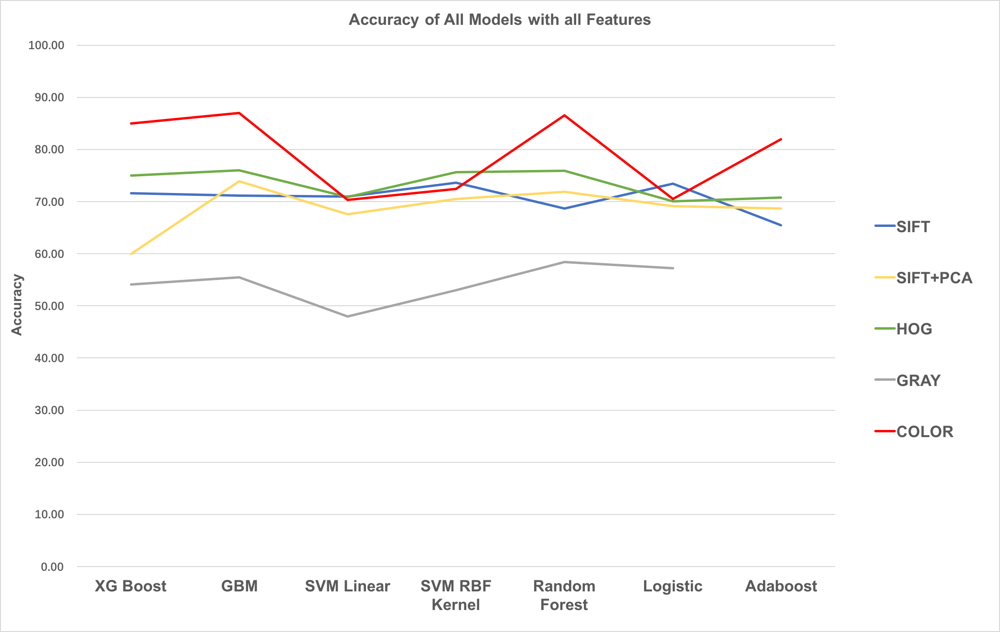
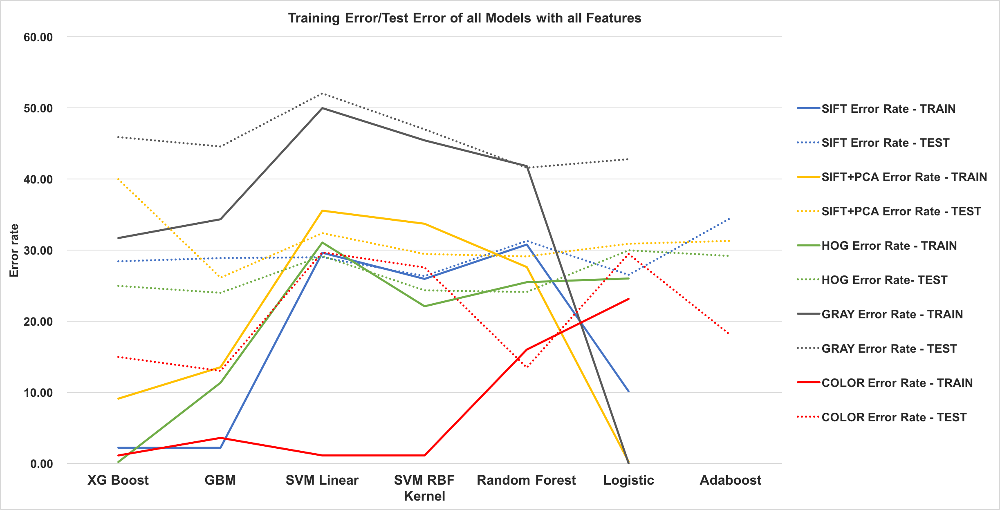
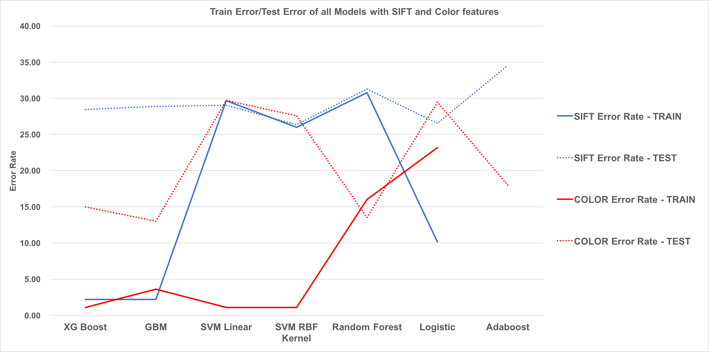

# Project: Dogs, Fried Chicken or Blueberry Muffins?


### [Full Project Description](doc/project3_desc.md)

Term: Spring 2018

+ Team #7
+ Team members
   + Chandak, Anshuma [ac4258@columbia.edu]()
   + Huang, Yuexuan [yh2966@columbia.edu]()
   + Li, Xinrou [xl2685@columbia.edu]()
   + Liu, Fangbing [fl2476@columbia.edu]()
   + Yan, Xiuruo [xy2358@columbia.edu]()

+ Project summary: In this project, we created a classification engine for images of dogs versus fried chicken versus blueberry muffins. 

 



**Contribution statement**: ([default](doc/a_note_on_contributions.md)) All team members contributed equally in all stages of this project. All team members approve our work presented in this GitHub repository including this contributions statement. 
 
 + **Chandak, Anshuma：** Built XG Boost model, and created SIFT + PCA feature. Applied XG Boost with SIFT, HOG, Gray, PCA, COLOR features. Modified the train.R and test.R files. Created the powerpoint presentation. Also, the presenter of this project from the group. 
 + **Huang, Yuexuan：**  Built baseline model(GBM). Applied GBM with SIFT, HOG, Gray, PCA features. Modified the train.R, test.R and cross_validation.R files.
 + **Li, Xinrou：**
 + **Liu, Fangbing：** Created HOG feature and built SVM Linear model and SVM with RBF Kernel model and applied them to all the features. Also modified the train.R, test.R and cross_validation.R files. Created the summary plots for the final result. And organized the GitHub folders.
 + **Yan, Xiuruo：** Created gray feature, color feature and built adaboost model and logistic model. Applied these two models with SIFT, HOG, Gray, PCA, COLOR features. Modified the feature.R, train.R, test.R and main.Rmd files. 

Following [suggestions](http://nicercode.github.io/blog/2013-04-05-projects/) by [RICH FITZJOHN](http://nicercode.github.io/about/#Team) (@richfitz). This folder is orgarnized as follows.

```
proj/
├── lib/
├── data/
├── doc/
├── figs/
└── output/
```

Please see each subfolder for a README file.
