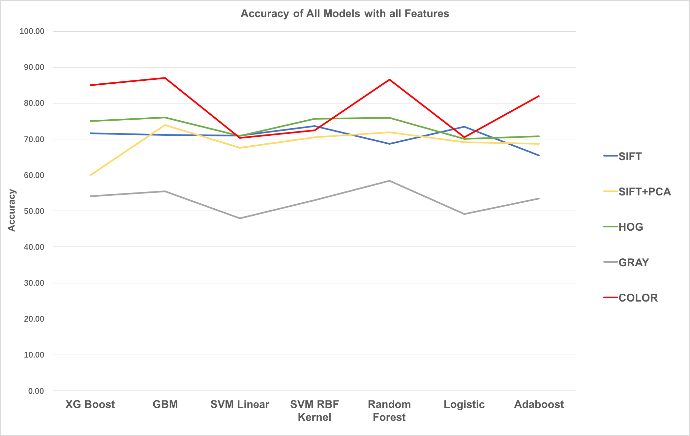
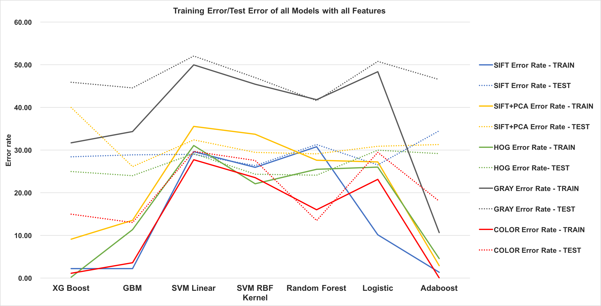
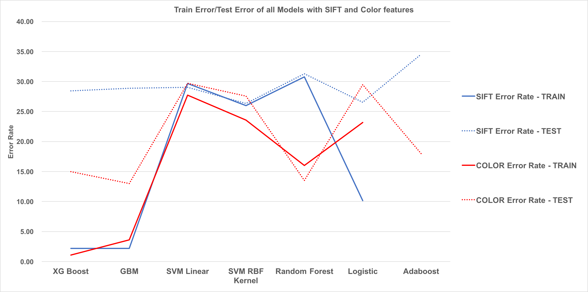

# Project 3: Dogs, Fried Chicken or Blueberry Muffins?


### [Full Project Description](doc/project3_desc.md)

Term: Spring 2018

+ Team #7
+ Team members
   + Chandak, Anshuma [ac4258@columbia.edu]()
   + Huang, Yuexuan [yh2966@columbia.edu]()
   + Li, Xinrou [xl2685@columbia.edu]()
   + Liu, Fangbing [fl2476@columbia.edu]()
   + Yan, Xiuruo [xy2358@columbia.edu]()

+ Project summary: In this project, we created a classification engine for images of dogs versus fried chicken versus blueberry muffins. Our Client is using a classification engine using boosted decision stumps on SIFT features. Our task is to propose a feasible improvement in client’s current practice to distinguish pictures of dogs (poodles and Chihuahuas), fried chicken and blueberry muffins. We were given a training set of 3000 images to train a new model. Our proposed model is using Gradient Boosting Machines on Color (RGB + HGV) features. The model leads to 13 percent error rate, with a running time of 0.86 seconds. This is a huge improvement from the Client's original model, which had an error rate of ~29 % .

The following charts give an exhaustive visual understanding of the performance of all the models we used using the different features we extracted.

 



**Contribution statement**: ([default](doc/a_note_on_contributions.md)) All team members contributed equally in all stages of this project. All team members approve our work presented in this GitHub repository including this contributions statement. 
 
 + **Chandak, Anshuma：** Kept track of the group meetings, and set the timeline for project completion.Built XG Boost model, and created SIFT + PCA feature. Applied XG Boost with SIFT, HOG, Gray, PCA, COLOR features. Modified the train.R and test.R files. Updated the **Summary** section in the Readme file of the project. Created the powerpoint presentation. Also, the presenter of this project from the group. 
 + **Huang, Yuexuan：**  Built baseline model(GBM). Applied GBM with SIFT, HOG, Gray, PCA, SIFT+PCA, COLOR features with cross validated parameters. Modified the train.R, test.R and cross_validation.R files. Helped prepare the presentation.
 + **Li, Xinrou：** Built the Random Forest Model, and trained Random Forest Model with SIFT, HOG, Gray, PCA, SIFT+PCA features with different parameters. Modified the main.Rmd files, feature.R, train.R, and test.R.
 + **Liu, Fangbing：** Created HOG feature and built SVM Linear model and SVM with RBF Kernel model and applied them to all the features. Also modified the train.R, test.R and cross_validation.R files. Created the summary plots for the final result. And organized the GitHub folders.
 + **Yan, Xiuruo：** Created gray feature, color feature and built adaboost model and logistic model. Applied these two models with SIFT, HOG, Gray, PCA, COLOR features. Modified the feature.R, train.R, test.R and main.Rmd files. 

References used: 
1. https://rpubs.com/mharris/multiclass_xgboost : Perform XGBoost  
2. https://en.wikipedia.org/wiki/AdaBoost : Perform Adaboost  
3. http://r-statistics.co/Logistic-Regression-With-R.html : Perform Logstic  
4. http://www.milanor.net/blog/cross-validation-for-predictive-analytics-using-r/ : CV error
5. https://cran.r-project.org/web/packages/gbm/gbm.pdf : Perform GBM


Following [suggestions](http://nicercode.github.io/blog/2013-04-05-projects/) by [RICH FITZJOHN](http://nicercode.github.io/about/#Team) (@richfitz). This folder is orgarnized as follows.

```
proj/
├── lib/
├── data/
├── doc/
├── figs/
└── output/
```

Please see each subfolder for a README file.
